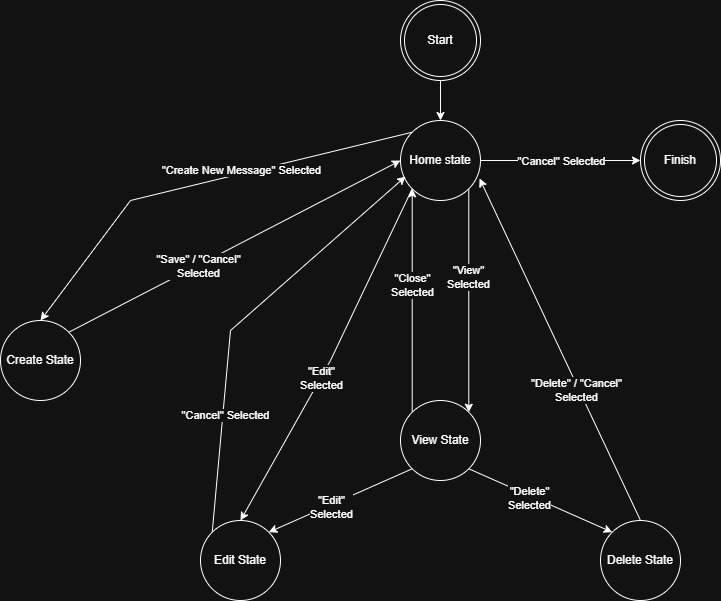
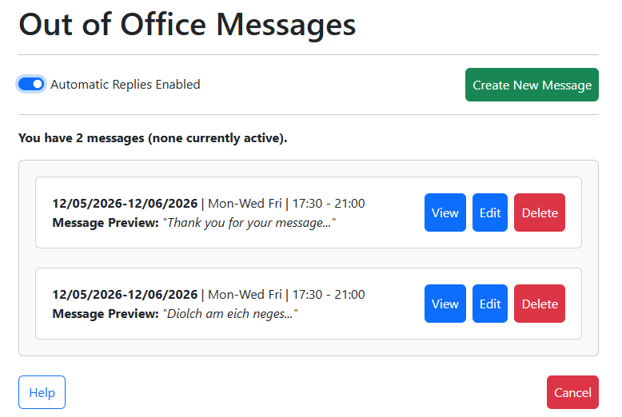
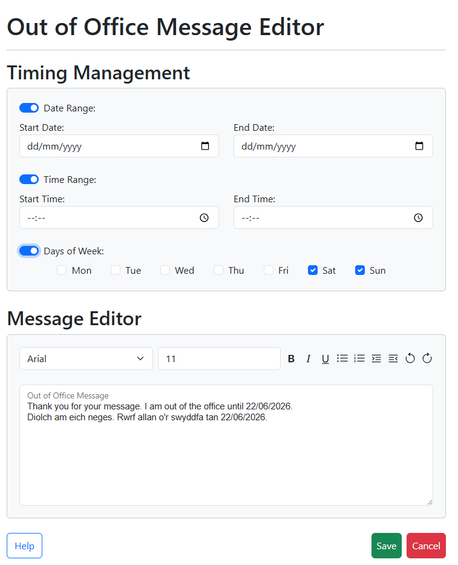
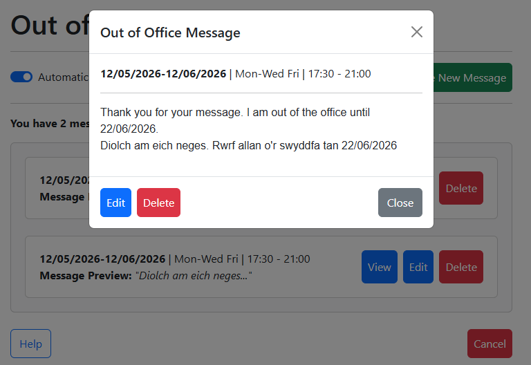
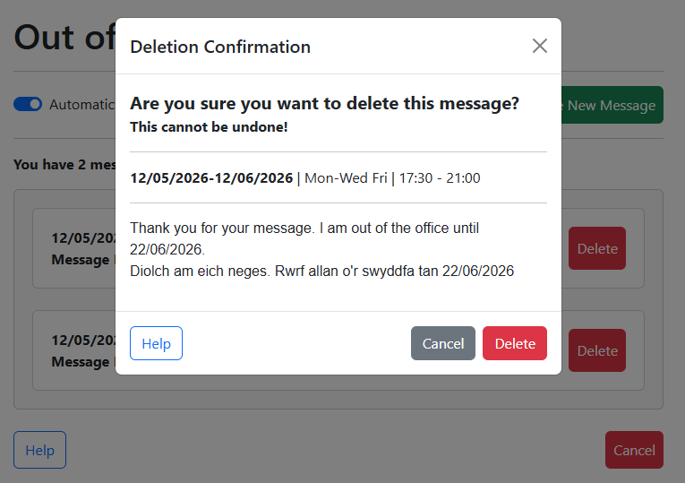

# Interface Design Report
**By Jessica Pelling (24064697)**

Link to Panopto Video: [https://cardiff.cloud.panopto.eu/Panopto/Pages/Viewer.aspx?id=27f9a284-8d4d-4bb4-98c0-b4110131222b](https://cardiff.cloud.panopto.eu/Panopto/Pages/Viewer.aspx?id=27f9a284-8d4d-4bb4-98c0-b4110131222b)

## State Transition Network

## User Interface Design and Prototype

### Screen Designs

#### Home State

#### Create / Edit States

Whilst these are different states, they look exactly the same. The create state will have all of the fields blank and ready for the user to fill in, whilst the edit state will load with the information of the message that the user wants to edit.

#### View State

#### Delete State

